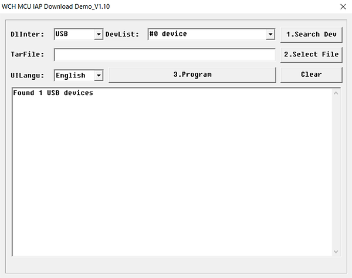
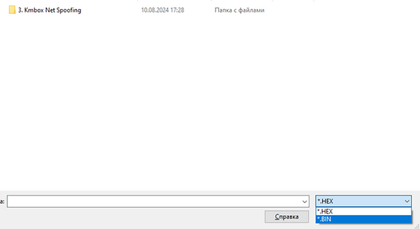
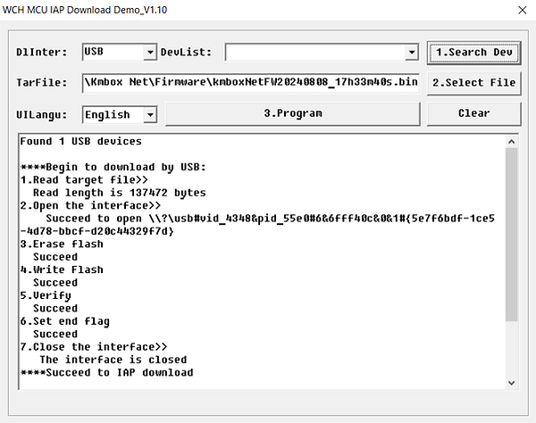

# Kmbox-Net-Flash-guide.
Updating Kmbox Net
1. The latest version of Kmbox Net you will get through our Discord server.

3. For the Flash you need to unplug your mouse from the Kmbox (plug your mouse into your main Pc)
The Two USB 2.0 cables need to be connected to your main pc as well.

5. First download the two drivers in the Folder (Flash Kmbox Net) on your main PC.

6. Then isntall the Driver (1.driver) on your main pc.

8.  Press and hold this small black button inside the Kmbox using a screwdriver or other thin object
9.  
10. And at the same time connect the USB cable to the bottom left USB port
11. 
12. The Kmbox screen should turn white, and the blue light should start flashing rapidly. If this doesn't happen, then try to hold the button again and reconnect the USB cable.

13. Now launch the Upgrade Tool. Click Search Device. In the information line, it should be written "Found 1 USB devices"
14. 
15. Click Select file then Change the type of files displayed to .BIN
16. 
17. Search and select the firmware file you download from our server.
18. And click "3.Program"
19. 
20. Firmware flash is now complete connect your Kmbox NET like in the Kmbox Net Guide.
