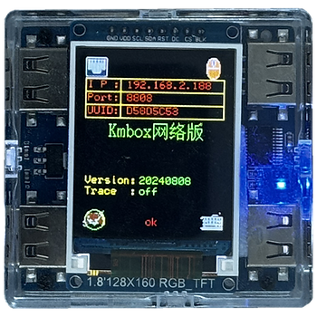

# Kmbox-Net-Flash-guide.
Updating Kmbox Net
1. The latest version of Kmbox Net you will get through our Discord server.
2. 
3. For the Flash you need to unplug your mouse from the Kmbox (plug your mouse into your main Pc)
4. The Two USB 2.0 cables need to be connected to your main pc as well.
